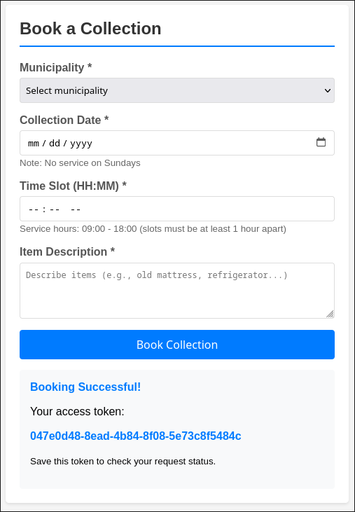
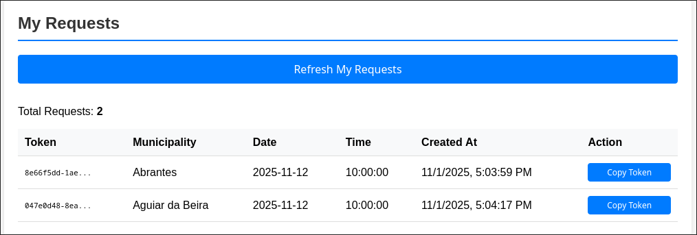
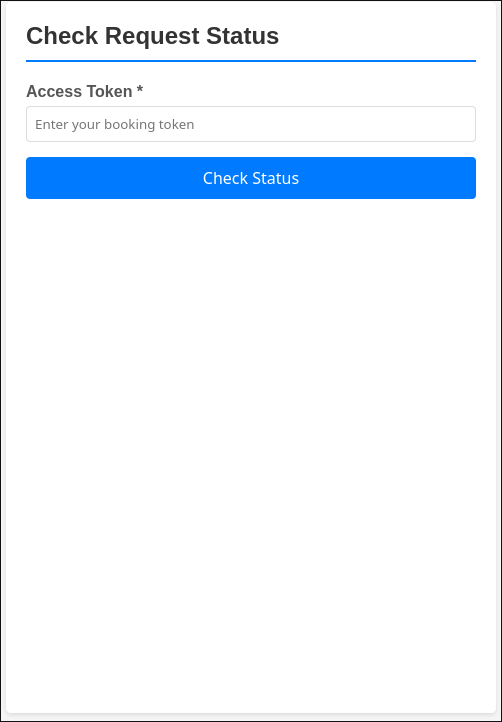
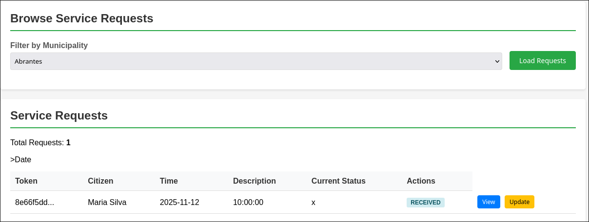
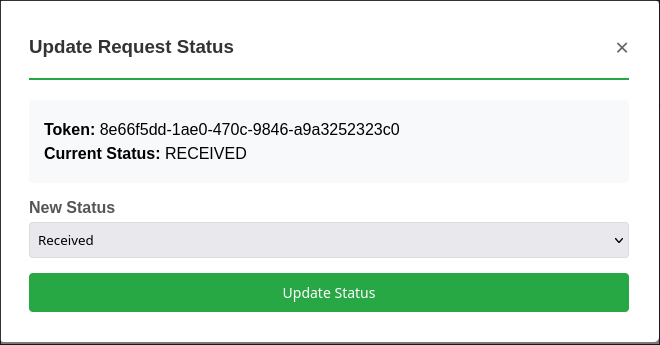
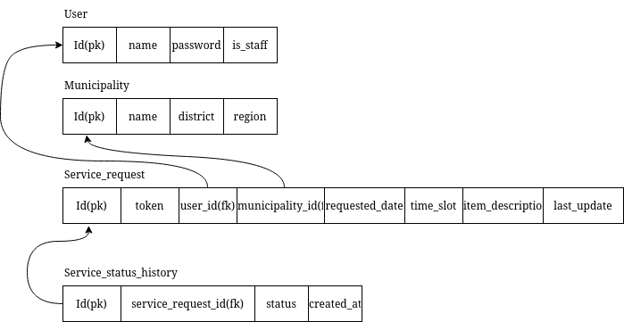

# ZeroMonos

A simple web application for citizens to book item collection services and for staff to manage those requests.

## Endpoints

The main web interfaces are:
- **/** — Homepage
- **/citizen** — Citizen portal
- **/staff** — Staff portal

The backend REST API is organized under the `org.hw1.boundary` package, with controllers handling user management, service requests, and authentication. Key endpoints include:
- `/requests` — Create, view, cancel, and update service requests
- `/users/authenticate` — User authentication

## Use Cases & Rules

### Booking and Management Rules
- Bookings cannot be made for past dates.
- Bookings are only allowed between 09:00 and 18:00.
- Bookings are not permitted on Sundays.
- Bookings with status *ASSIGNED* cannot be canceled.
- Booking status cannot be changed to an earlier state.

ZeroMonos supports two main user roles:

- **Citizens** can:
  - Log in to the portal
  - Book garbage collection services by selecting municipality, date, time, and providing a description
    
  - View their bookings
    
  - Check the status of their requests and cancel if eligible
    <p align="center">
      
      
    </p>

- **Staff** can:
  - Log in to the staff portal
  - Filter and view service requests by municipality
    
  - Update the status of requests
    

For detailed user scenarios—such as booking a service, logging in, and managing requests—see the [feature files](src/test/resources/features).

## Database


## H2
By default, the project uses H2 as the database.

### PostgresDB

**Start Container**
```bash
docker run --name postgresdb -e POSTGRES_USER=admin -e POSTGRES_PASSWORD=secret -e POSTGRES_DB=zeromonos -p 5432:5432 -d postgres:latest
```

**Run application with postgres config**
```bash
mvn clean spring-boot:run -Dspring-boot.run.profiles=postgres
```

## Build & Run

Copy `.env.example` to `.env` and update it with your configuration.

Then start the application with:

```bash
mvn spring-boot:run
```
